# FujiShaderGPU 富士シェーダーGPU🌋
- Lightning fast terrain shader for a big Cloud Optimized GeoTIFF
- Cloud Optimized GeoTIFFの為の電光石火DEM地形可視化シェーダー

GPUを使って処理することでCPUの数百倍の速度で計算できます。

## Install インストール
```bash
pip install git+https://github.com/geoign/FujiShaderGPU.git
```
- Requires CUDA environment (nVidia GPU). <br>See below if you are non-Linux user.
- CUDA実行環境が必要です(nVidia社のGPU)。<br>非Linuxユーザーは後半のセクションを参照してください。

## Usage 使い方
```bash
fujishadergpu infile.tif outfile.tif --algo [See below for the supported algorithms]
```
- More than >10 algorithms are available.
- 現在のバージョンでは、10個以上のアルゴリズムをサポートしています。

⭐[Try at Google Colab.](https://colab.research.google.com/drive/1IbIGtaoKM9e1OsdxdnzNN7KeO1W_gRwZ?usp=sharing)⭐ <br>
↑ Google Colabで試すことができます。Google Driveから読み込み書き出します。<br>
Colab Notebook Last Updated on: 2025/06/09.

## Algorithms アルゴリズム
### Ridge Valley Index (RVI) 尾根谷度
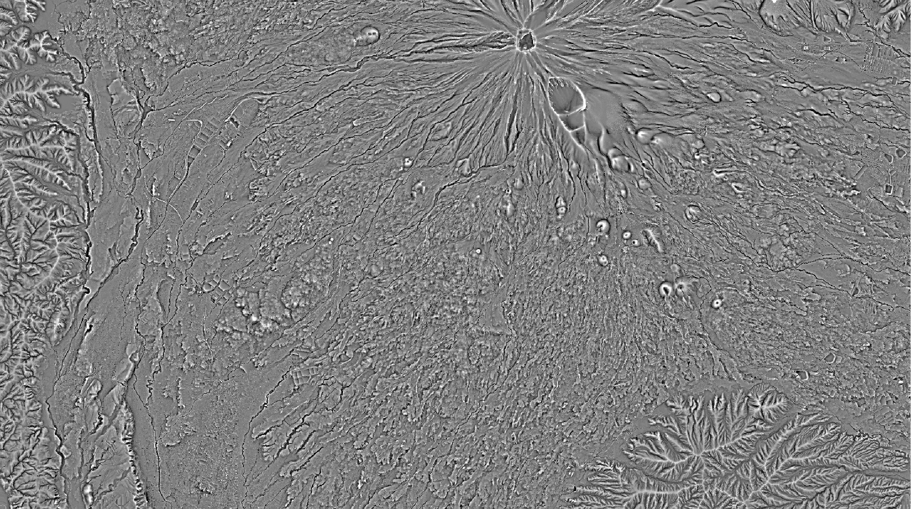
```bash
fujishader DEM.tif RVI.tif --algo rvi
```
| Optional Parameters | Example | Description |
| :-------- | :------- | :-------- |
| --radius | TBD | TBD    |
- Highlights the ridges and shadows the valley.<br>Note that it is different implementation from the original for speed and effeciency.
- 尾根を白くし谷を暗くします。<br>オリジナルとは異なる簡易的高速実装です。

### Hillshade 疑似陰影
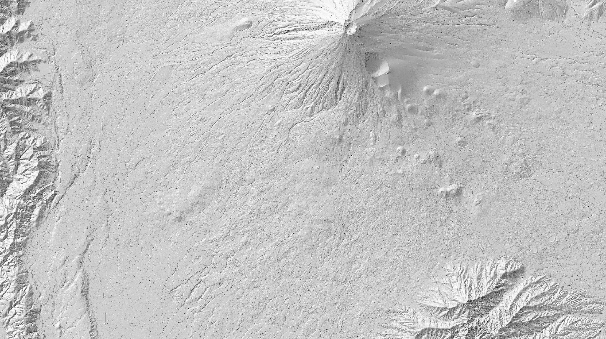
```bash
fujishader DEM.tif HLS.tif --algo hillshade
```
- Needless to say.
- 説明不要。

### Slope 傾斜量
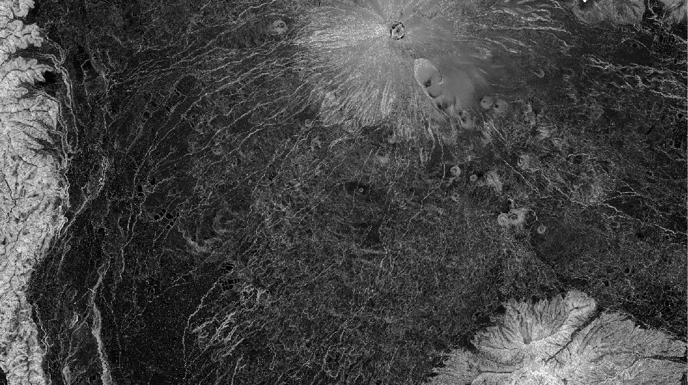
```bash
fujishader DEM.tif SLP.tif --algo slope
```
- Needless to say.
- 説明不要。

### Topographic Position Index (TPI)
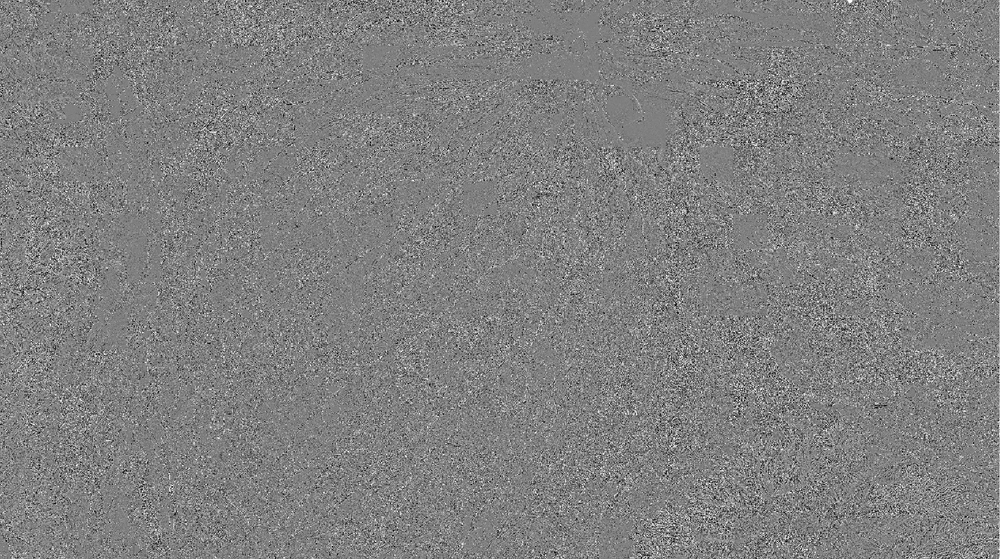
```bash
fujishader DEM.tif TPI.tif --algo tpi
```
- Relative height against the surrounding pixels.
- 相対標高です。

### Local Relief Model (LRM)
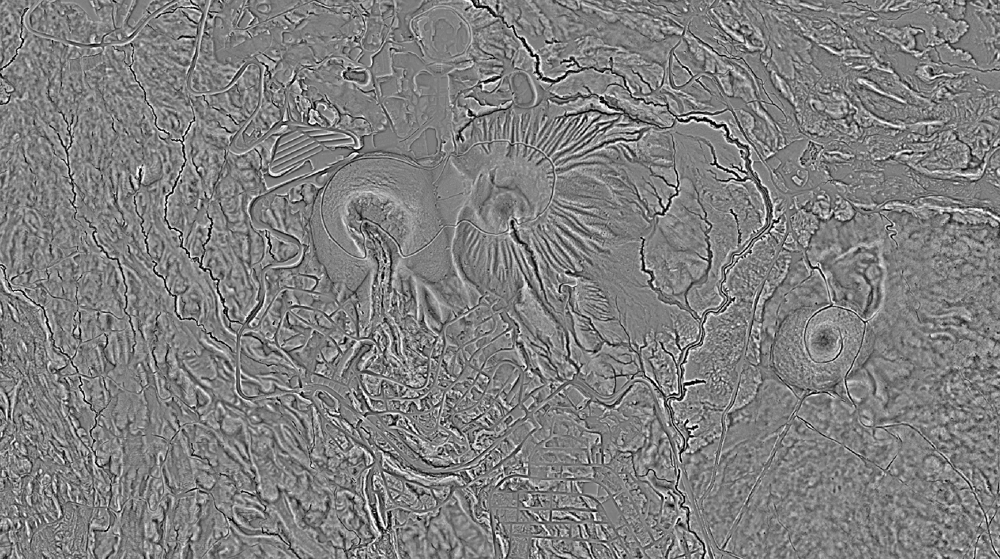
```bash
fujishader DEM.tif LRM.tif --algo lrm
```

### Openness 地形開度
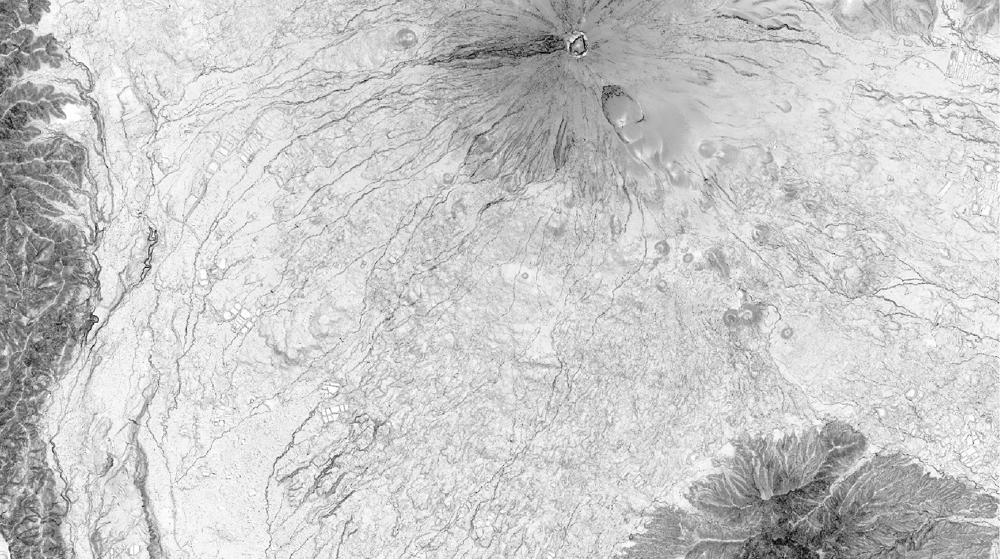
```bash
fujishader DEM.tif OPN.tif --algo openness
```

### Specular/Metallic shade 金属光沢
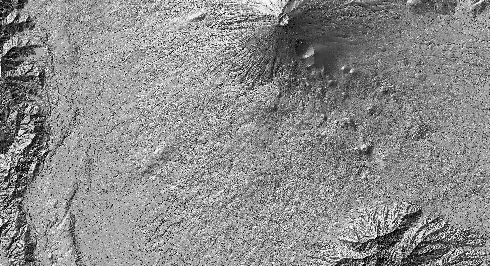
```bash
fujishader DEM.tif SPC.tif --algo specular
```
- Simulation of specular surface based on the terrain roughness.<br>An original algorithm.
- 地形の荒々しさを反映した光沢陰影。<br>独自アルゴリズム

### Atmospheric Scattering 大気散乱光陰影
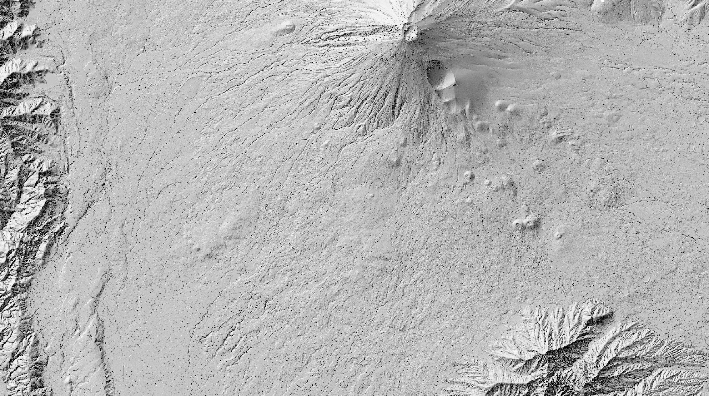
```bash
fujishader DEM.tif ASC.tif --algo atmospheric_scattering
```
- Simulation of the shading by atmospheric scattering.
- 大気散乱光による陰影効果。

### Multiscale Terrain マルチスケール地形
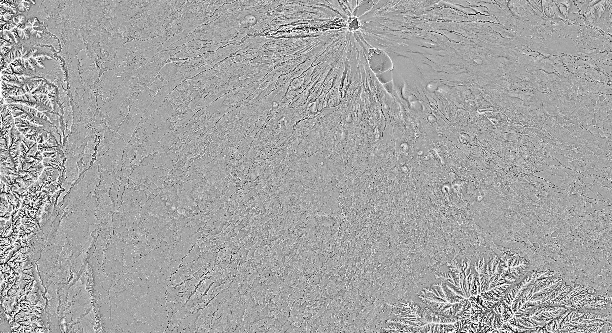
```bash
fujishader DEM.tif MST.tif --algo multiscale_terrain
```

### Frequency Enhancement 波長強調

```bash
fujishader DEM.tif FEH.tif --algo frequency_enhancement
```
- Enhancing the certain pattern of topography. 
- 地形の特定パターンを強調する。

## Curvature 地形曲率

```bash
fujishader DEM.tif CVT.tif --algo curvature
```
- Fringes of the topography.
- 地形の輪郭。

## Visual Saliency 視覚的顕著性

```bash
fujishader DEM.tif VSL.tif --algo visual_saliency
```

## NPR Edges (Canny) NPR輪郭検出
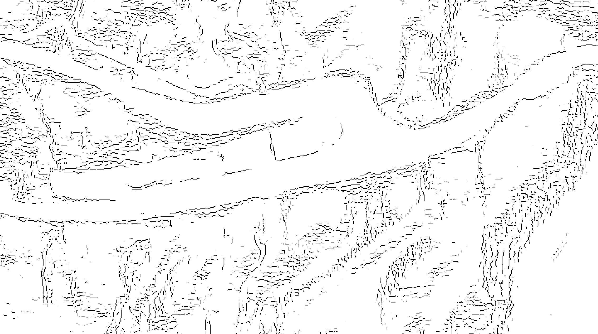
```bash
fujishader DEM.tif NPR.tif --algo npr_edges
```
- Fringes of the topography.
- 地形の輪郭。

## Atmospheric Perspective 空気遠近法
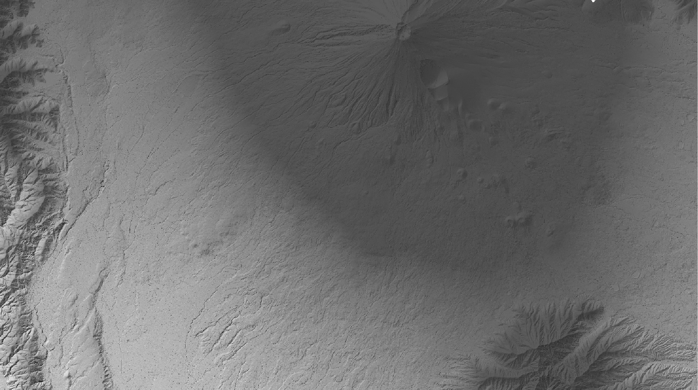
```bash
fujishader DEM.tif APS.tif --algo atmospheric_perspective
```
- Blurring the distant low-relief terrain.
- 視覚的に遠くに位置する低地がぼやけます。

## Ambient Occlusion アンビエントオクルージョン
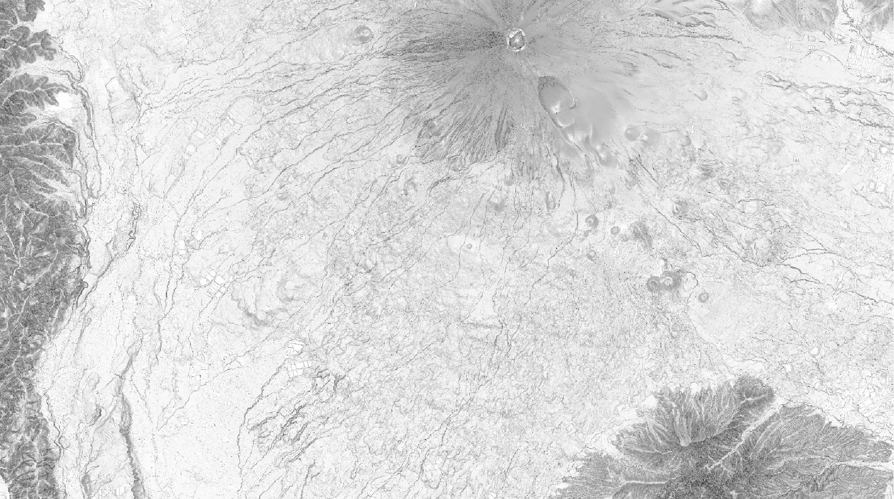
```bash
fujishader DEM.tif AOC.tif --algo ambient_occlusion
```
- Simulation of the ambient shadows. Popular in 3D modeling.
- 環境陰影のシミュレーション。3Dモデリングでよく使われる。

## Limitations 注意事項
- FujiShaderGPU is designed for the Cartesian DEMs.<br>It can process LatLon DEMs too but the result is not accurate.
- 富士シェーダーは直交座標系のDEMの処理を想定しています。<br>緯度経度座標系のDEMも処理できますが、結果は正確ではありません。

## Benchmark ベンチマーク
### nVidia A100 GPU (Google Colab)
- 70,000 x 70,000 pixels: 5~10 min. (Processing) + 10 min. (COG packaging)
- 220,000 x 240,000 pixels: 60 min. (Processing) + ? min. (COG packaging)

### nVidia RTX4070 Laptop (Windows)
- 60,000 x 30,000 pixels: 5 min. (Processing) + 10 min. (COG packaging)

## For Windows users:
- FujiShaderGPU has two pipelines: "dask-cuda" and "tile". There is no compatibility. <br>The "dask-cuda" only work for Linux and WSL (Windows Subsystem for Linux).<br>The "tile" pipeline is an original ad-hoc routine and is not well maintained at the moment.
- 富士シェーダーGPUは２つのパイプラインを持っています: "dask-cuda"と"tile"です。互換性はありません。<br>"dask-cuda"はLinuxとWSL (Windows Subsystem for Linux)のみサポートしています。<br>"tile"パイプラインは自作のアドホックルーチンであり、現状ではあまりメンテナンスされていません。

## For Mac users:
- Mac is not supported because there is no nVidia GPU on Mac.

## ChangeLog
- 2025/06/09 0.1.4 Fixed problems. dask-based algorithms were implemented.<br>Original "tile" based algorithms were moved to backup.
- 2025/06/08 0.1.4 Broke the repository by an accident T_T.
- 2025/06/07 0.1.0 Initial upload. Only RVI support.

## Maintainer 作成者
池上郁彦 (Fumihiko IKEGAMI) / Ikegami GeoResearch

## Acknowledgements 謝辞
ChatGPT o3 & Claude Sonnet 4
