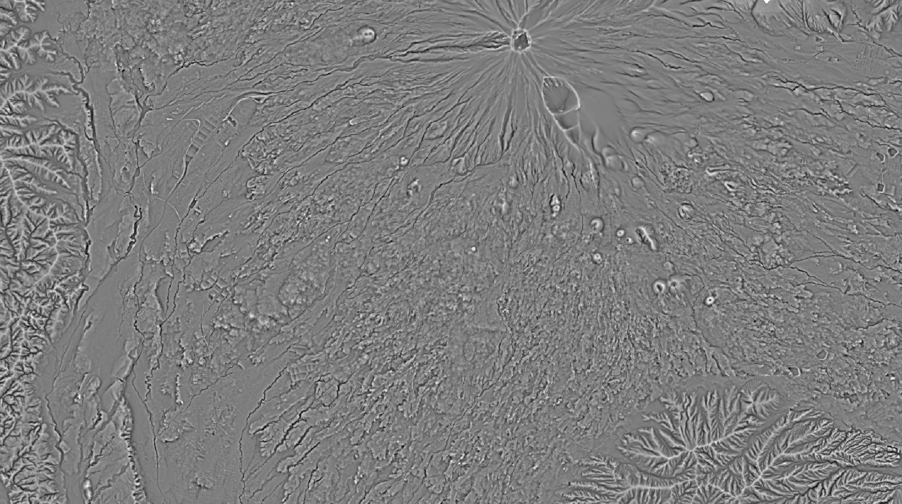

# FujiShaderGPU 富士シェーダーGPU🌋
- Lightning fast terrain shader for a big Cloud Optimized GeoTIFF
- Cloud Optimized GeoTIFFの為の電光石火DEM地形可視化シェーダー

GPUを使って処理することでCPUの数百倍の速度で計算できます。

## Install インストール
```bash
pip install git+https://github.com/geoign/FujiShaderGPU.git
```
- Requires CUDA environment (nVidia GPU). <br>See below if you are non-Linux user.
- CUDA実行環境が必要(nVidia社のGPU)。<br>非Linuxユーザーは後半のセクションを参照のこと。

## Usage 使い方
```bash
fujishadergpu infile.tif outfile.tif --algo [See below for the supported algorithms]
```
- More than >10 algorithms are available.
- 現在のバージョンでは、10個以上のアルゴリズムをサポートしている。

⭐[Try at Google Colab.](https://colab.research.google.com/drive/1IbIGtaoKM9e1OsdxdnzNN7KeO1W_gRwZ?usp=sharing)⭐ <br>
↑ Google Colabで試すことができる。Google Driveから読み込み書き出しできる。<br>
Colab Notebook Last Updated on: 2025/06/09.

## Algorithms アルゴリズム
- The result of the most of the algorithms are calibrated to human vision gamma.
- 多くの手法の結果データは、人間の知覚ガンマに合致するように正規化されている。

### Ridge Valley Index (RVI) 尾根谷度

```bash
fujishadergpu DEM.tif RVI.tif --algo rvi
```
| Optional Parameters | Example | Description |
| :-------- | :------- | :-------- |
| --mode | radius | Here is the example for radius mode. |
| --radii | 4,16,64,256 | The array of radius in pixels.<br>4,16,64,256 works good for most cases.<br>You may add 1024, 4096 too. |
| --weigts |  | Leave it None (auto) is the best. |
| --auto_radii |  | Automatically set radii. It is the default. |

| Optional Parameters | Example | Description |
| :-------- | :------- | :-------- |
| --mode | sigma | Here is the example for sigma mode. |
| --sigmas | 4,16,64,256 | The array of sigma in pixels.<br>Setting to a large number will slow down the process. |
| --weigts |  | Leave it None (auto) is the best. |
| --auto_sigma |  | Automatically set sigma. I do not recommend it. |

- Highlights the ridges and shadows the valley.<br>Note that it is different implementation from the original for speed and effeciency.
- 尾根を白くし谷を暗くする。<br>オリジナルとは異なる簡易的高速実装。

### Hillshade 疑似陰影

```bash
fujishadergpu DEM.tif HLS.tif --algo hillshade
```
| Optional Parameters | Example | Description |
| :-------- | :------- | :-------- |
| --azimuth | 315 | Leave it default (None or 315). |
| --altitude | 45 | Leave it default (None or 45). |
| --z_factor | 1.0 | Set around 0.005 if you want to shade LatLon Grid. |
| --multiscale | False | False by default. Set --sigmas if True. |
| --sigmas | 4,16,64,256 | Only work when --multiscale is True. |
- The hillshade effect. Needless to say.
- オーソドックスな陰影効果。説明不要。

### Slope 傾斜量

```bash
fujishadergpu DEM.tif SLP.tif --algo slope
```
| Optional Parameters | Example | Description |
| :-------- | :------- | :-------- |
| --unit | degree | The unit of the output slope map. <br>degree or percent or radians |
- Slope angles. Needless to say.
- オーソドックスな傾斜量図。説明不要。

### Topographic Position Index (TPI)

```bash
fujishadergpu DEM.tif TPI.tif --algo tpi
```
| Optional Parameters | Example | Description |
| :-------- | :------- | :-------- |
| --radius | 10 | Radius in pixels. I would use 10-100. |
- Relative height against the surrounding pixels.
- 周辺ピクセルに対する相対標高。

### Local Relief Model (LRM)

```bash
fujishadergpu DEM.tif LRM.tif --algo lrm
```
| Optional Parameters | Example | Description |
| :-------- | :------- | :-------- |
| --kernel_size | 50 | Remove fine terrain: 5-15<br>Remove medium-sized terrain: 20-50<br>Remove large-scaled terrain: 50-100 |
- Not for noob. Set appropriate parameters to get a good result.
- 上級者向け。適切なパラメータを指定しないとよい結果は得られない。

### Openness 地形開度

```bash
fujishadergpu DEM.tif OPN.tif --algo openness
```
| Optional Parameters | Example | Description |
| :-------- | :------- | :-------- |
| --openness_type | positive | positive or negative |
| --num_directions | 16 | Reduce to spped up. |
| --max_distance | 50 | Max search distance in pixels. |

### Specular/Metallic shade 金属光沢

```bash
fujishadergpu DEM.tif SPC.tif --algo specular
```
| Optional Parameters | Example | Description |
| :-------- | :------- | :-------- |
| --light_azimuth | 315 | Leave it to default (None or 315). |
| --light_altitude | 45 | Leave it to default (None or 45). |
| --roughness_scale | 50 | Local stdev of the heights. i.e. kernel scale. <br> It is 50 by default and it is good. |
| --shininess | 20 | It is 20 by default and is good. |
- Simulation of specular surface based on the terrain roughness.<br>An original algorithm by myself.
- 地形の荒々しさを反映した金属光沢陰影。<br>自身による独自アルゴリズム。

### Atmospheric Scattering 大気散乱光陰影

```bash
fujishadergpu DEM.tif ASC.tif --algo atmospheric_scattering
```
| Optional Parameters | Example | Description |
| :-------- | :------- | :-------- |
| --scattering_strength | 0.5 | It is 0.5 by default and is good. |
- Simulation of the shading by atmospheric scattering (Rayleigh scattering).
- 大気散乱光(レイリー散乱)による陰影効果。

### Multiscale Terrain マルチスケール地形

```bash
fujishadergpu DEM.tif MST.tif --algo multiscale_terrain
```
| Optional Parameters | Example | Description |
| :-------- | :------- | :-------- |
| --scales | 2,8,32,128 | The default values are okay. |
| --weights |  | Leave it None so that is automatically calculated. |
- Multiscale Terrain
- マルチスケール地形

### Frequency Enhancement 波長強調

```bash
fujishadergpu DEM.tif FEH.tif --algo frequency_enhancement
```
| Optional Parameters | Example | Description |
| :-------- | :------- | :-------- |
| --target_frequency | 0.1 | Enhance large-scale terrains -> Set 0.05 <br>Enhance fine-scale terrains -> Set 0.2~0.3 |
| --bandwidth | 0.05 | Window to enhance the terrain with certain frequency. <br>0.05 is a good value. |
| --enhancement | 2.0 | Setting it to a very large number is fun. |
- Not for noob. Set appropriate parameters to get a good result.
- 上級者向け。適切なパラメータを指定しないとよい結果は得られない。

### Curvature 地形曲率

```bash
fujishadergpu DEM.tif CVT.tif --algo curvature
```
- Fringes of the topography.
- 地形の輪郭。

### Visual Saliency 視覚的顕著性

```bash
fujishadergpu DEM.tif VSL.tif --algo visual_saliency
```

### NPR Edges (Canny) NPR輪郭検出

```bash
fujishadergpu DEM.tif NPR.tif --algo npr_edges
```
- Fringes of the topography.
- 地形の輪郭。

### Atmospheric Perspective 空気遠近法

```bash
fujishadergpu DEM.tif APS.tif --algo atmospheric_perspective
```
- Blurring the distant low-relief terrain.
- 視覚的に遠くに位置する低地がぼやけ…るのか？

### Ambient Occlusion アンビエントオクルージョン

```bash
fujishadergpu DEM.tif AOC.tif --algo ambient_occlusion
```
- Simulation of the ambient shadows. Popular in 3D modeling.
- 環境陰影のシミュレーション。3Dモデリングでよく使われる。

### Algorithms TBD? 実装検討中のアルゴリズム
- Scale-space Blob Detection（LoG / DoG）
- Hessian ベースの Vesselness / Ridge フィルタ
- Superpixel Segmentation（SLIC／SEEDS／SNIC など）
- Structure Tensor + Orientation Field
- Persistent Homology / Topological Data Analysis (TDA)

## Limitations 注意事項
- FujiShaderGPU is designed for the Cartesian DEMs.<br>It can process LatLon DEMs too but the result is not accurate.
- 富士シェーダーは直交座標系のDEMの処理を想定しています。<br>緯度経度座標系のDEMも処理できますが、結果は正確ではありません。

## Benchmark ベンチマーク
### nVidia A100 GPU (Google Colab)
- 70,000 x 70,000 pixels: 5~10 min. (Processing) + 10 min. (COG packaging)
- 220,000 x 240,000 pixels: 60 min. (Processing) + ? min. (COG packaging)

### nVidia RTX4070 Laptop (Windows)
- 60,000 x 30,000 pixels: 5 min. (Processing) + 10 min. (COG packaging)

## For Windows users:
- FujiShaderGPU has two pipelines: "dask-cuda" and "tile". There is no compatibility. <br>The "dask-cuda" only work for Linux and WSL (Windows Subsystem for Linux).<br>The "tile" pipeline is an original ad-hoc routine and is not well maintained at the moment.
- 富士シェーダーGPUは２つのパイプラインを持っています: "dask-cuda"と"tile"です。互換性はありません。<br>"dask-cuda"はLinuxとWSL (Windows Subsystem for Linux)のみサポートしています。<br>"tile"パイプラインは自作のアドホックルーチンであり、現状ではあまりメンテナンスされていません。

## For Mac users:
- Mac is not supported because there is no nVidia GPU on Mac.

## ChangeLog
- 2025/06/09 0.1.4 Fixed problems. dask-based algorithms were implemented.<br>Original "tile" based algorithms were moved to backup.
- 2025/06/08 0.1.4 Broke the repository by an accident T_T.
- 2025/06/07 0.1.0 Initial upload. Only RVI support.

## Maintainer 作成者
池上郁彦 (Fumihiko IKEGAMI) / Ikegami GeoResearch

## Acknowledgements 謝辞
ChatGPT o3 & Claude Sonnet 4
